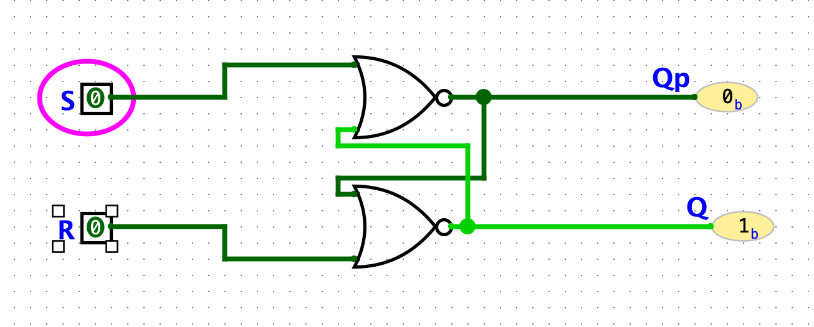

## Assignment 1: Decoder
**Q: Give a short explanation for how you have verified that your design is completely correct.**

A: As seen in the images the design satisfies the expected truthtable.
<!-- 6x4 markdown table -->
| A0 | A1 | Y0 | Y1 | Y2 | Y3 |
| ------------- | ------------- | ------------- | ------------- | ------------- | ------------- |
| **1**         | **1**         | 0             | 0             | 0             | **1**         |
| 0             | **1**         | 0             | 0             | **1**         | 0             |
| **1**         | 0             | 0             | **1**         | 0             | 0             |
| 0             | 0             | **1**         | 0             | 0             | 0             |

## Assignment 2: Multiplexer
### Task 2.1

**Q: Explain why output “MUX out” is blue, why output signal “Equal?” is red, and the select signal of the 4:1 multiplexer is black.**

A: The output "MUX out" is blue since the wires carried binary value is unkown. The "Equal" is red due to an error since the XOR has no input wires. Black is for wires carrying multibit values.

### Task 2.2
**Q1:Include a screenshot of your complete design. Note that it should look similar to the figure in task 2.1, but with additional wires. You are not allowed to add any extra components.**

A1:

**Q2: Explain how you can test the correctness of the component using the output signal “Equals?”.**

## Assignment 3: Adder
### Task 3.1
**Q:Include a screenshot of your design. Note that you need to find out what input signal A should have, to fulfill the requirements in task 3.1. The figure should contain the correct input and output signal values.**

A: 

### Task 3.2
**Q:Include a screenshot of your design. Your design should use the input and output values that were requested in task 3.1.**

A: 

## Assignment 4: Latches
### Task 4.1
**Q1: Include a screenshot where both S and R are 0. Explain what the possible values for Q and Q' can be.**

A1:

IF S & R are 0 then either Q or Q' has to be 1 and the other 0. Both cannot be 1 or 0.

**Q2: Include a screenshot where S = 1 and R = 0. Explain the possible values for Q and Q' in this case. If you toggle S (switch between 0 and 1), do then Q or Q' change? Why or why not?**

A2: 

Q has to be 1 and Q' has to be 0. If S is toggled between 0 and 1 if S is toggled on and off nothing happens since the trigger wont change the NOR state.

**Q3: What happens if S is equal to 0 and R is toggled between 1 and 0?**

A3:
Q was 1 before like question 2 then it would first switch to 0 while Q' is 1. After that subsequent toggles will have no effect.

### Task 4.2

**Q1: Include a screenshot of your complete design of the D latch, when both the D and the CLK signals are 0. Explain what happens if D is equal to 0 and you toggle CLK? What happens if CLK is 0 and you toggle D? Are Q and Q' changed? Why or why not?**

A1:

Currently 1 is stored in the latch. If D is 0 and CLK is pressed the Q will switch to 0. This happens since our latch will store what is in D when CLK is one at location Q. And NOT Q in Q'. If CLK is 0 and D is pressed nothing happens since since the CLK is the mechanism for telling the latch to actually store the value in D at Q.

**Q2: What happens if CLK is 1 and you toggle D?**

A2:
Now, every time we toggle D the values of Q and Q' will switch since we are CLK = 1 means store whats in D at Q and if we update D we will also update Q (and Q').

**Q3: Explain the benefits with the D latch compared to the SR latch.**

A3:
The main difference in functionality is that if CLK or Store is 0 changes in D will have no effect.
    

**Q4: Explain the problem with D latches and why they are not used in synchronous sequential logic.**

A4: 
Race condition. When we initally power on both the system both NOR gates will have double 0 as input so their output will be 1. However, they are interlinked. In a perfectly simmulated environment this would cause them to ocillate between both on and then both off. Due to physical limitations though the result is that either Q is 1 and Qp is 0 or the other way around. We don't know the initial state.

This can be seen by removing the inputs in logisim and the wires between the NORs turning RED

## Assignment 5: D Flip-Flops and Registers
### Task 5.1
**Q1: Include a screenshot of your design of the D Flip-Flop, where the two D latches are subcircuits.**

A1:

**Q2: Explain in what circumstances the value of Q changes. Explain by giving concrete examples.**

A2: When Din = !Q and CLK is toggled to 1. 

### Task 5.2
**Q1: Include a screenshot of your design.**

## Assignment 6: Design of a Synchronous Sequential Circuit

### Task 6.1
